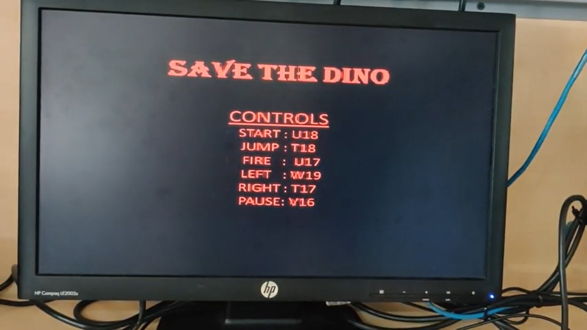
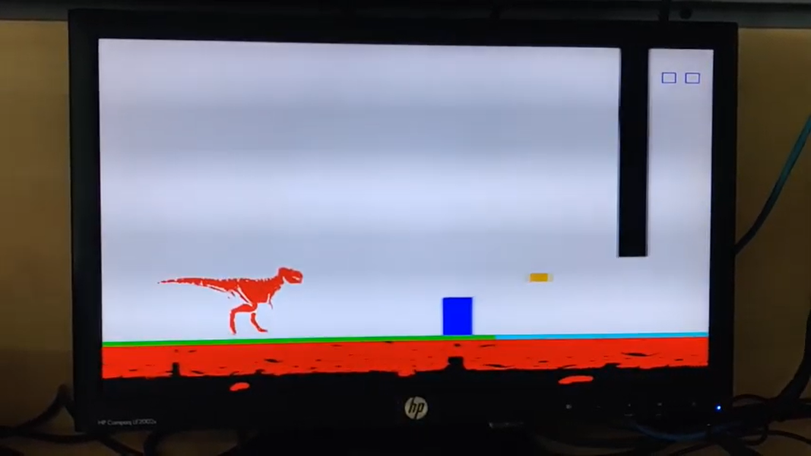
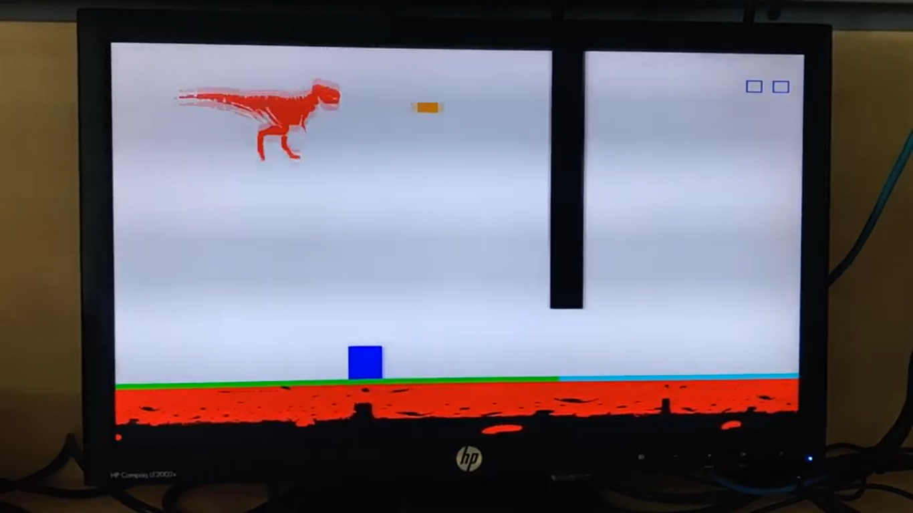
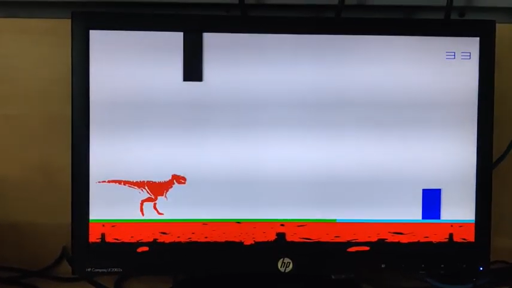
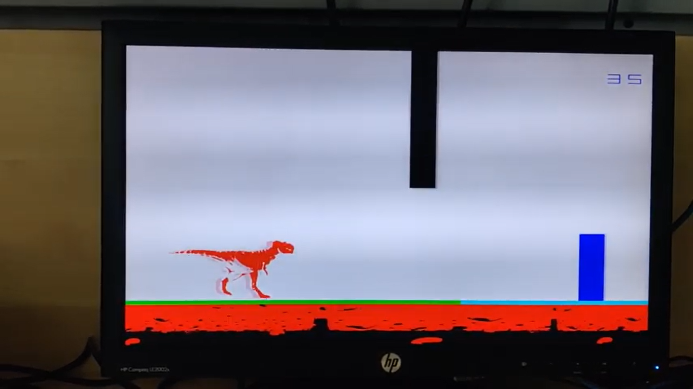

## Description

--> Designed an interactive VGA Game by programming a Basys 3 FPGA board using Verilog coding on Xilinx Vivado tool.

--> The main source code files are top_VGA_game.v, vga_ctrl.v, vga_game.v, clk_div, bin2bcd.v and pb_debounce.v

--> Movements are given to the objects in the game by rapidly changing their positions using the concept of FSMs.

--> The velocities given to some objects are also varied with FSMs to imitate the effect of acceleration, deceleration and gravity.

--> The images of the walking dinosaur, the moving ground, the menu screen and the digits representing the current score are formed with the help of the binary image data provided in the .coe files.

--> The constraints.xdc file is a standard constraint file for specifying the I/O interfaces such as switches, push-buttons, etc.

--> The objective of the game is to make the dinosaur either dodge the incoming obstacles (by jumping or staying gounded) or to destroy them by firing bullets.

--> If the dinosaur gets hit by an obstacle, the game is over.

## Live Demo Link

https://www.youtube.com/watch?v=e2N09m09URE&list=PLPbeWYWLwPjBZnGLtcGu-Brst7LBIUf9f

## Gameplay Snapshots

